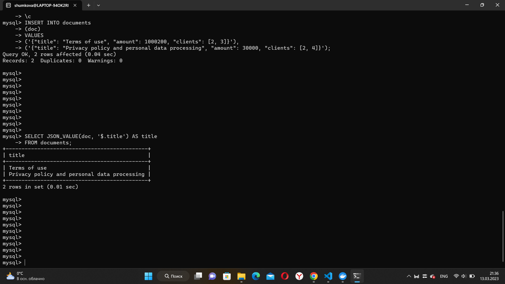

Домашнее задание  Типы данных

Описание/Пошаговая инструкция выполнения домашнего задания:

----проанализировать типы данных в своем проекте, изменить при необходимости. В README указать что на что поменялось и почему.

docker run --name mysql8 -e MYSQL_ROOT_PASSWORD=my_sql -p 3309:3306 -d mysql   //создание и запуск контейнера mysql8

docker ps    //проверка какой запущен контейнер

docker exec -it mysql8 mysql -uroot -p  //подключение и вход под пользователем с паролем

CREATE database new_year_decoration;  //создание БД new_year_decoration

SHOW DATABASES;         //просмотр баз данных

USE new_year_decoration //использовать базу данных new_year_decoration

-------------Создание таблицы "Страна производителя"

CREATE TABLE country_manufactures (id_country int PRIMARY KEY NOT NULL, name_country varchar(32) NOT NULL);

INSERT INTO country_manufactures (id_country, name_country)
VALUES (1, 'Россия');

SELECT * FROM country_manufactures;  //просмотр таблицы country_manufactures

-------------Создание таблицы "Производители"

CREATE TABLE manufactures (
    id_manufactures int PRIMARY KEY NOT NULL,  //числовой тип данных
    name_manufactures varchar(32) NOT NULL,    //Символьный тип данных
    address varchar(50) NOT NULL,              //в адресе используются и буквы и цифры
    id_country int NOT NULL
);

-------------Создание таблицы "Покупатели"

CREATE TABLE buyers (
    id_buyers int PRIMARY KEY NOT NULL,
    name_buyers varchar(32) NOT NULL,
    telephone numeric(11),                     //числовой тип данных без цифр после точки, поэтому указано общее количество цифр
    email varchar(32)                          //символьный тип данных для электронной почты
);

-------------Создание таблицы "Гирлянды"

CREATE TABLE garland (
    id_garland int PRIMARY KEY NOT NULL,
    name_garland varchar(32) NOT NULL,
    article int UNIQUE,                        //артикул должен быть уникальным
    id_manufactures int NOT NULL,
    price decimal(9,2),                        //для цены числовой тип с фиксированной точкой
    stock int,
    discount float(4,2)                        //максимальная скидка может быть 99,99%
);

SHOW tables;  //просмотр таблиц БД

-----добавить тип JSON в структуру. Проанализировать какие данные могли бы там хранится. привести примеры SQL для добавления записей и выборки.

-------------Создание таблицы "Документы"

CREATE TABLE documents (doc JSON);

INSERT INTO documents
(doc)
VALUES
('{"title": "Terms of use", "amount": 1000200, "clients": [2, 3]}'),
('{"title": "Privacy policy and personal data processing", "amount": 30000, "clients": [2, 4]}');

SELECT JSON_VALUE(doc, '$.title') AS title
FROM documents;

