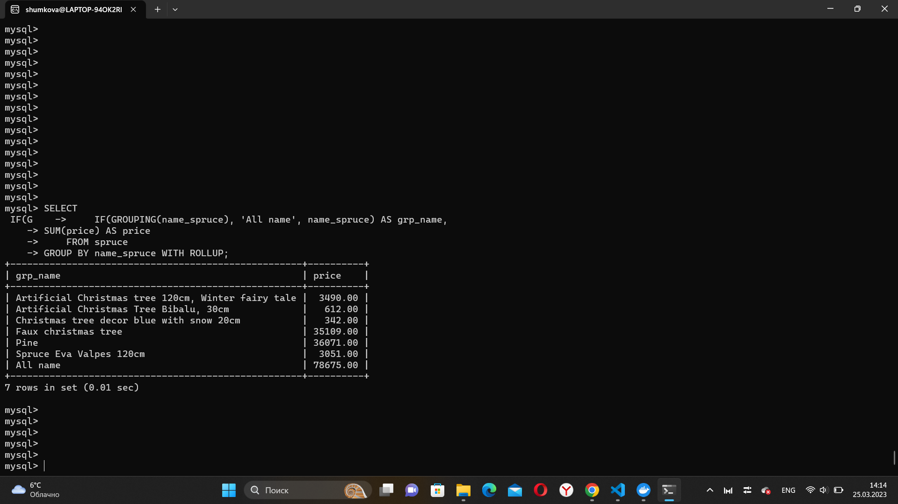

Домашнее задание
Создаем отчетную выборку

Цель:
Научимся создавать ответную выборку

Описание/Пошаговая инструкция выполнения домашнего задания:
предоставить следующий результат
группировки с ипользованием CASE, HAVING, ROLLUP, GROUPING() :

-для магазина к предыдущему списку продуктов добавить максимальную и минимальную цену и кол-во предложений

-также сделать выборку показывающую самый дорогой и самый дешевый товар в каждой категории

-сделать rollup с количеством товаров по категориям

------Просмотр товаров по высокой и низкой цене

SELECT name_spruce, price, 
CASE
    WHEN price > 1000
        THEN 'High price'
    WHEN price <= 1000
        THEN 'Low price'
    ELSE 0
END AS Category
FROM spruce
GROUP BY name_spruce, price;

-----Посмотреть самый дорогой и самый дешевый товар

-----Вывести товары, у которых минимальная цена меньше 1000 руб.

SELECT name_spruce, MIN(price) AS LowestPrice
FROM spruce
GROUP BY name_spruce
HAVING MIN(price) < 1000;

-----Вывести товары, у которых максимальная цена больше 2500 руб.

SELECT name_spruce, MAX(price) AS HighestPrice
FROM spruce
GROUP BY name_spruce
HAVING HighestPrice > 2500;

-----Группировка по именованию товара и вывод суммы

SELECT
    IF(GROUPING(name_spruce), 'All name', name_spruce) AS grp_name,
	SUM(price) AS price
    FROM spruce
GROUP BY name_spruce WITH ROLLUP;

-----Вывод количества товара по именованию

SELECT name_spruce, COUNT(*) AS quantity
FROM spruce
GROUP BY name_spruce;

-----Объединение суммы товаров и его количества

SELECT
    IF(GROUPING(name_spruce), 'All name', name_spruce) AS grp_name,
	SUM(price) AS 'price/quantity'
    FROM spruce
GROUP BY name_spruce WITH ROLLUP
UNION ALL
SELECT name_spruce, COUNT(*)
FROM spruce
GROUP BY name_spruce;

